<h1 align="center">Сервис заказа космических автомобилей</h1>

---

    Pet-проект, демонстрирующий мои актуальные навыки работы
    с современными web-технологиями на практике.
    Проект постоянно обновляется, добавляются новые фичи, рефакторится код.

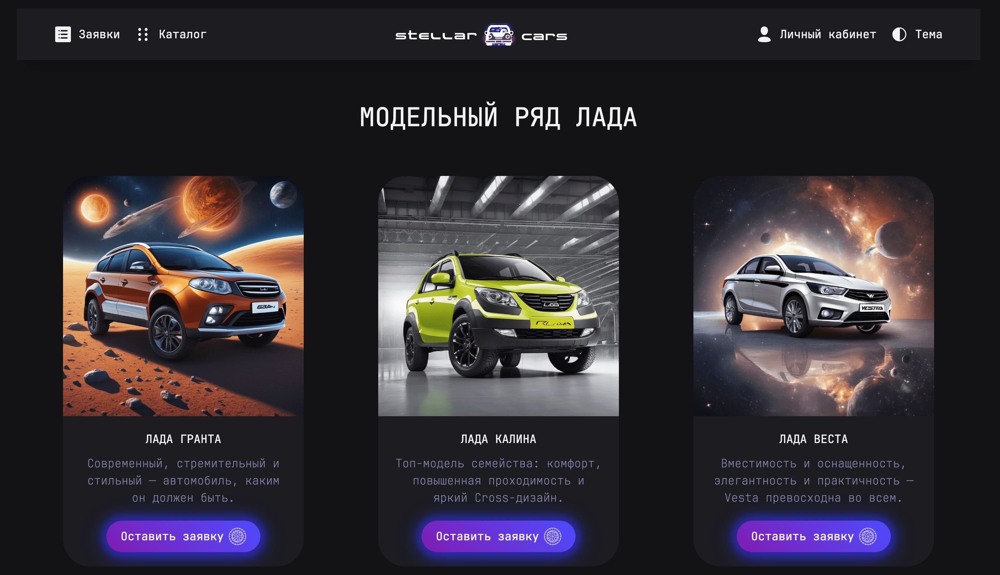

## Содержание

- [Техническое задание](#Техническое-задание)
- [Функциональность](#Функциональность)
- [Стек](#стек)
- [Директории проекта](#Директории-проекта)
- [Описание](#Описание)
- [Установка](#установка)
- [Запуск](#запуск)
- [Команды для работы с проектом](#Команды-для-работы-с-проектом)
- [Планы](#Планы)
- [Ссылки на проект](#Ссылки-на-проект)

## Техническое задание:

---

    Реализовать сервис регистрации автомобилей с каталогом авто.
    Обязательно используем: любой стейт менеджер (например mobx, redux), любой сборщик (например webpack, vite), react, typescript.

### Страницы:

      - Авторизация

      - Список заявок в виде таблицы с возможностью сортировки и фильтрации на фронте (на беке не реализовано)

      - Страница заявки (ниже подробнее)

      - Страница с списком брендов авто (берем из справочника нашей api) с фотографиями и описанием автомобилей (берем из интернета)

      - Страница пользователя (в api особо ничего нет, выводит просто логин и почту). И возможность разлогиниться

### Страница заявки (заявка может быть в 4 разных статусах):

      DRAFT - страница с формой заполнения данных (id, status не заполняем)
        
      PENDING - если перешли сразу с DRAFT (через /proposal/{id}/send), то выводим loader, если из списочной - выводим ридонли страницу со всеми данными

      SUCCESS - страница успеха, выводим ридонли данные

      REJECTED - страница неудачи, выводи ридонли данные

### Форма:

    Требуется валидация данных (по примеру существующей заявки, валидации на бэке нет)

## Функциональность:

---

- конфигурация `webpack` на typeScript
- автоматический прогон тестов и деплой через `github actions`
- обработчик ошибок `ErrorBoundary`
- глобальные переменные стилей `global.scss`
- хранение данных в хранилище `Redux`
- работа с `API` через RTK Query
- сортировка и фильтрация заявок
- создание / редактирование / изменение / рассмотрение заявки
- валидация форм через `yup` и `React Hook Form`
- смена тем

## Стек:

---

  &nbsp
  &nbsp
  &nbsp
  &nbsp
  &nbsp
  &nbsp
  &nbsp
  &nbsp
  &nbsp
  &nbsp
  &nbsp

## Директории проекта:

---

- `.github` — директория с github actions
- `config` — директория с конфигами webpack и jest(в разработке)
- `docs` — директория с production сборкой
- `public` — директория с html
- `src` — директория с архитектурой проекта

### Архитектура проекта - Feature-Sliced Design (FSD):
- `src/shared` — директория с переиспользуемыми модулями
- `src/entities` — директория с компонентами, связанными с представлением бизнес-сущностей
- `src/features` — директория с частями функциональности приложения
- `src/widgets` — директория с самостоятельными и полноценными блоками страниц с конкретными действиями
- `src/pages` — директория со страницами приложения
- `src/app` — директория с общей инициализирующей логикой приложения

## Описание:

***

### Login
- Компонент с формой входа;
- Используется react hook form;
- Настроена валидация через библиотеку yup;
- Уведомление пользователя о не валидности введенных данных;
- Лоудер, всплывающий при загрузке данных;
- Появляющееся сообщение об успехе/ошибке;

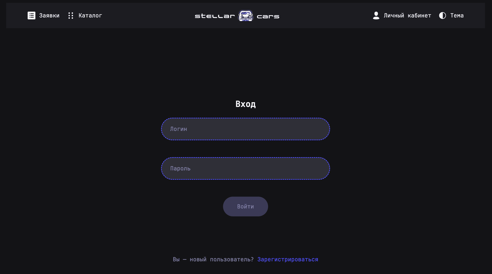

### Catalog
- Компонент с каталогом доступных автомобилей;
- Из массива данных, пришедшего с бэкенда формируются модельные ряды и отображаются карточки автомобилей;

### User
- Компонент с информацией о пользователе;
- Отображает id и логин пользователя;

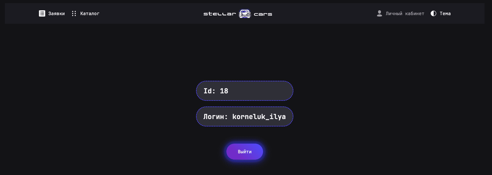

### Proposals
- Компонент отображающий все заявки;
- Реализована фильтрация по статусу заявки;
- Есть возможность asc и desc сортировки по каждому заголовку таблицы;
- Семантически-правильно составленная таблица;
- Кнопка с возможностью создания новой заявки;

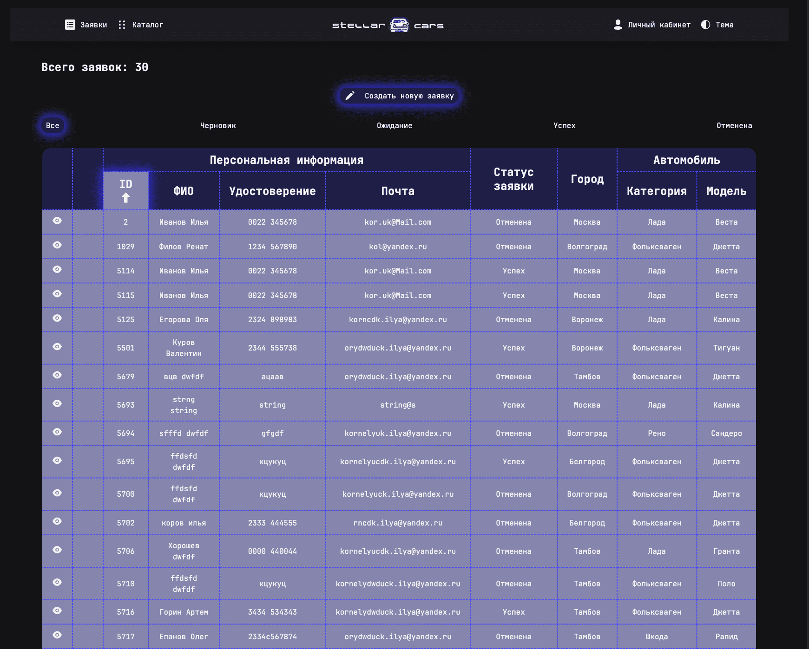

### Proposal
- Компонент отображающий информацию по заявке;
- Отображения статуса заявки в виде infoTooltip;

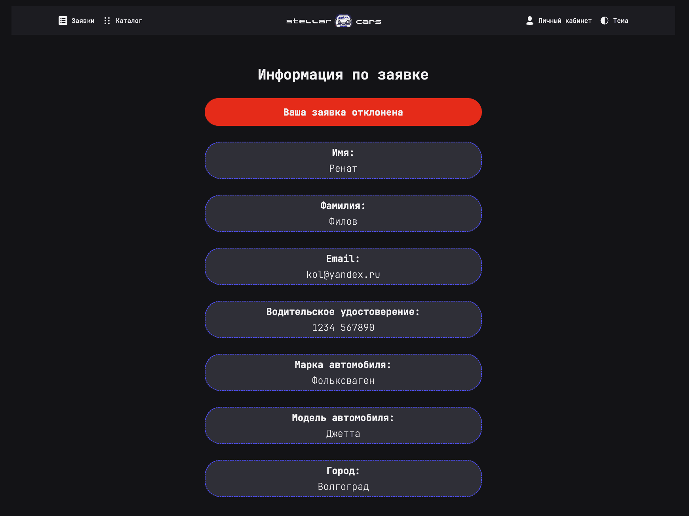

### Функциональность заявок
- Реализована возможность создания заявки;
  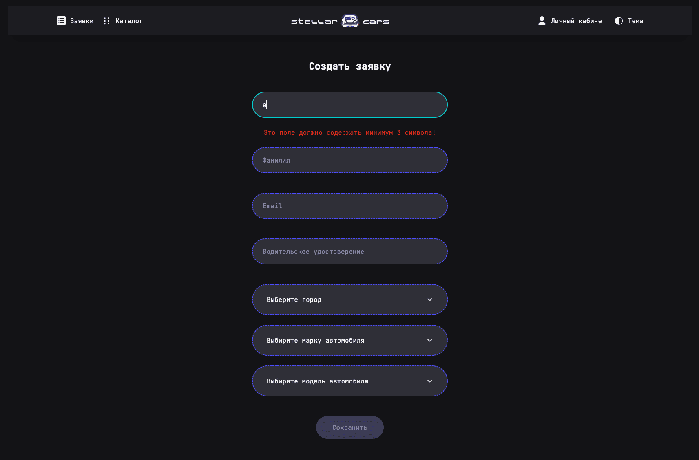
- Реализована возможность редактирования заявки;
  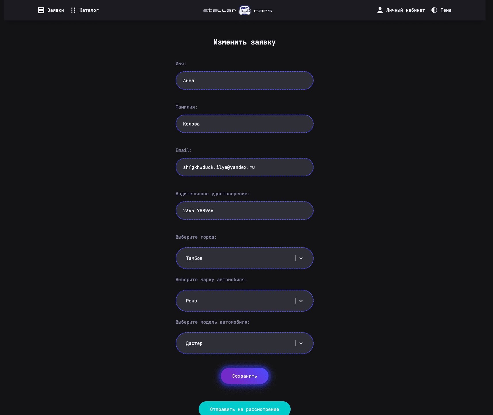
- Реализована возможность рассмотрения заявки;
  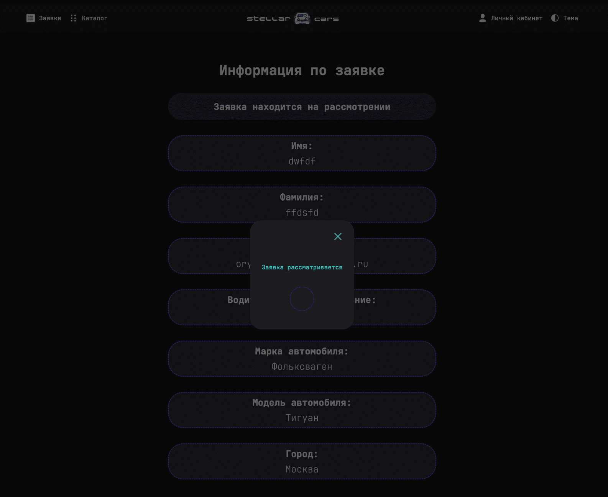
- Реализована возможность удаления заявки;
  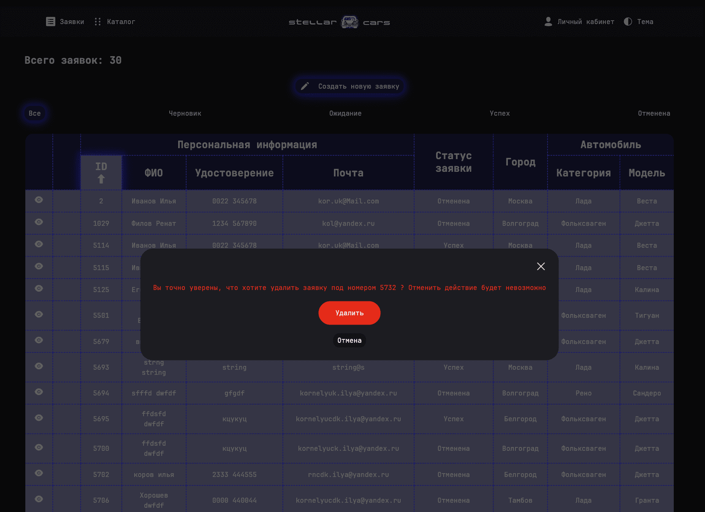

### Валидация форм
- Подключена валидация всех форм по yup-схемам

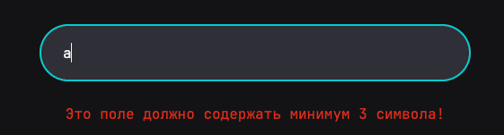

### Тема
- Реализовано переключение светлой темы на темную

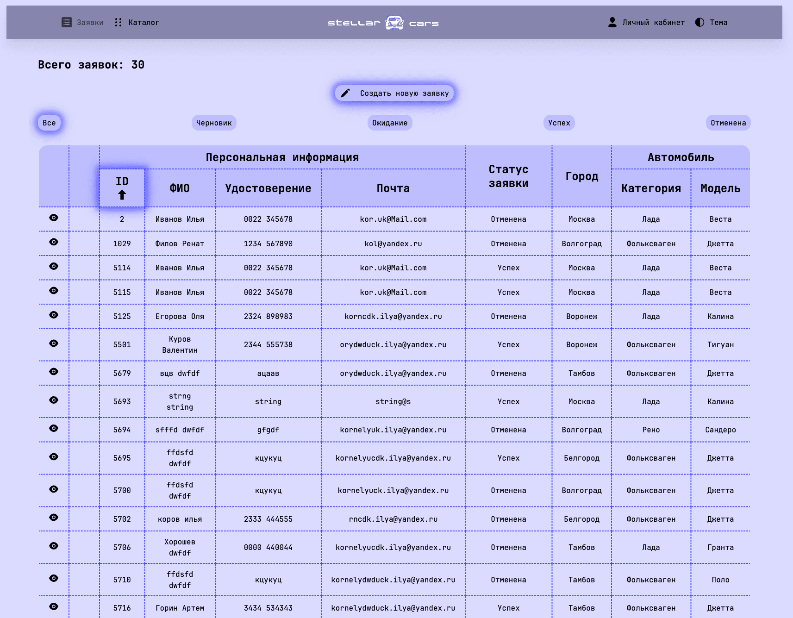

## Команды для работы с проектом:

---

- `npm start` - запускает проект в `dev` режиме;
- `npm run build:prod` - сборка проекта в `prod` режиме;
- `npm run build:dev` - сборка проекта в `dev` режиме;
- `npm run lint:ts` - запуск линтнера для `TypeScript`;
- `npm run lint:ts:fix` - исправление ошибок линтнера для `TypeScript`;
- `npm run lint:scss` - запуск линтнера для `SCSS`;
- `npm run lint:scss:fix` - исправление ошибок линтнера для `SCSS`;

## Планы:

---

- Добавить unit тестирование
- Добавить сторибук

## Ссылки на проект:

---

- `Адрес репозитория:` https://github.com/ilkor4/stellar-cars
- `Деплой:` https://ilkor4.github.io
- `Над проектом работал:` https://github.com/ilkor4

